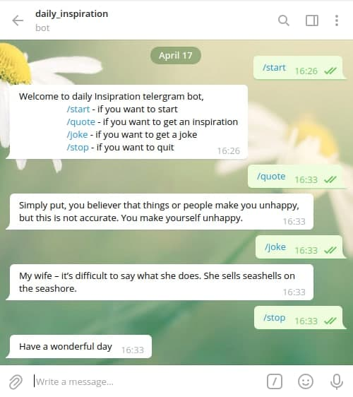

# myTelegramBot

This is a Telegram bot built on Ruby. The main goal of this project is to put into practice the main concepts of Object Oriented Programming.

## Built With

- Ruby

## Test With

- Rspec `gem install rsepc`
- then run `rspec spec/bot_test.rb`

## Getting Started

To get a local copy up and running follow these simple example steps.
Clone repository from github to your local drive by following these steps:

- Open Terminal
- Change the current working directory to the location you want the cloned directory
- You can clone the repository writing in terminal:
  - `git clone https://github.com/ShoiraTa/myTelegramBot.git`.
  - Press Enter to create your local clone
- Make sure you have ruby installed locally run `ruby -v`\*\*
- Run `bundler install.`
- Run `cd myTelegramBot` in the terminal\*\*
- To run bot type `ruby ./bin/main.rb` in the terminal\*\*
- Open telegram find @dailyin_bot

### Prerequisites

- Text editor
- Account in @Telegram
- GitHub
- Ruby

### Commands

- /start - if you want to start
- /quote - if you want to get an inspiration
- /joke - if you want to get a joke
- /stop - if you want to quit

## Authors

👤 **Shoira Toshpulatova**

- GitHub: [@githubhandle](https://github.com/shoirata)
- LinkedIn: [LinkedIn](https://www.linkedin.com/in/shoira-tashpulatova-bab4a7122/)

## Acknowledgments

- Microverse
- The Odin Project

## 📝 License

This project is [MIT](./LICENSE) licensed.
